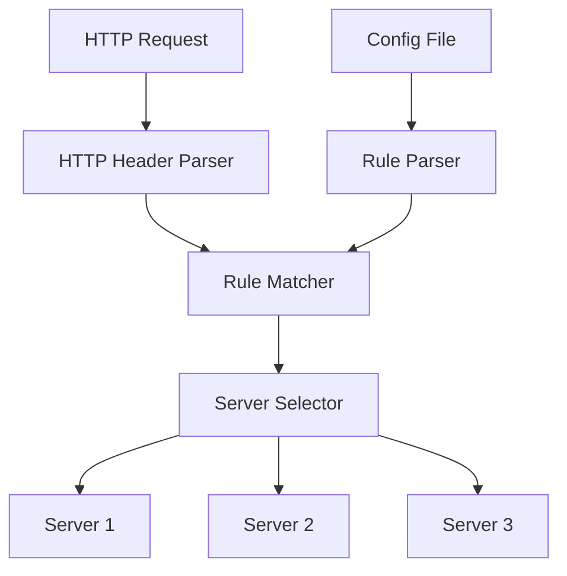

# Server Round Robin Project

[](LICENSE)
[](https://www.cprogramming.com/)
[](https://www.gnu.org/software/make/)

## Overview
This project implements a server round-robin system that distributes HTTP requests across multiple servers based on configurable rules. It parses HTTP headers and matches them against rules defined in a configuration file to determine the appropriate server for request routing.

### System Architecture


## Features
- HTTP header parsing with support for standard HTTP/1.1 headers
- Configuration file rule parsing with flexible rule definitions
- Round-robin server selection for load balancing
- Support for multiple server addresses and ports
- Flexible rule matching system with multiple matching methods
- Memory-efficient implementation
- Thread-safe operations

## Project Structure
```
Server_Ronud_Robin/
├── source/                 # Source code directory
│   ├── http_main.c        # Main program entry point
│   ├── http_parsing.c     # HTTP header parsing implementation
│   ├── rule_parsing.c     # Configuration file parsing
│   ├── compare.c          # Rule matching logic
│   ├── mem_string.c       # String manipulation utilities
│   └── parsing_list.c     # Data structure implementations
├── test_case/             # Test cases and examples
│   ├── test_headers/      # Sample HTTP headers
│   └── config_files/      # Sample configuration files
└── README.md             # This file
```

## Data Structures

### Rule Node
```c
typedef struct rule_node {
    int type;              // Rule type (e.g., PATH, HOST, METHOD)
    int match;             // Match method (e.g., EXACT, PREFIX, SUFFIX)
    char* string;          // String to match
    struct addr_node* addr_node;  // Associated server address
    struct rule_node* tail;       // List management
    struct rule_node* next;
    struct rule_node* prev;
} _rule_node;
```

### Address Node
```c
typedef struct addr_node {
    char* ip;              // Server IP address
    char* port;            // Server port
    struct rule_node* tail;  // List management
    struct rule_node* next;
    struct rule_node* prev;
} _addr_node;
```

## Usage

### Prerequisites
- GCC compiler (version 4.8 or higher)
- Make utility
- Linux/Unix environment

### Compilation
```bash
# Clone the repository
git clone https://github.com/ChoiHongSuk/Server_Ronud_Robin.git
cd Server_Ronud_Robin

# Compile the project
cd source
make clean
make
```

### Running the Program
```bash
# Basic usage
./http_main config.txt

# With debug output
./http_main -d config.txt

# With custom log file
./http_main -l custom.log config.txt
```

### Input Format
1. Enter the path to the HTTP header file when prompted
2. The program will output the selected server address
3. Enter 'q' to exit the program

Example:
```
HTTP header path (or Exit: q) > test.txt
192.168.216.173:443
HTTP header path (or Exit: q) > test.txt
192.168.216.172:443
HTTP header path (or Exit: q) > q
Program terminated.
```

## Configuration File Format
The configuration file defines rules for server selection. Each rule consists of:
- Type: The type of rule (PATH, HOST, METHOD)
- Match: The matching method (EXACT, PREFIX, SUFFIX)
- String: The string to match against
- Server addresses: List of servers to route to

Example configuration:
```text
# Rule format: TYPE MATCH STRING IP:PORT
PATH EXACT /api/v1 192.168.1.1:8080
HOST PREFIX api. 192.168.1.2:8080
METHOD EXACT POST 192.168.1.3:8080
```

## Implementation Details

### HTTP Header Parsing
- Parses incoming HTTP headers
- Extracts relevant information for rule matching
- Supports standard HTTP header formats
- Handles malformed headers gracefully

Example HTTP header:
```http
GET /api/v1/users HTTP/1.1
Host: api.example.com
User-Agent: Mozilla/5.0
Accept: application/json
```

### Rule Parsing
- Reads configuration file line by line
- Splits lines by space delimiter
- Creates rule nodes for each configuration entry
- Validates rule format and content

### Rule Matching
- Compares parsed HTTP headers with configuration rules
- Uses specified matching methods to find appropriate server
- Implements round-robin selection among matching servers
- Handles multiple matching rules with priority

### Memory Management
- Custom string manipulation functions
- Efficient memory allocation and deallocation
- Safe string operations
- Memory leak prevention

## Performance Considerations
- Efficient string matching algorithms
- Minimal memory allocation
- Fast rule lookup
- Optimized server selection

## Dependencies
- C standard library
- Make build system
- POSIX-compliant operating system

## Build Requirements
- GCC compiler (version 4.8 or higher)
- Make utility
- POSIX-compliant operating system

## Testing
```bash
# Run all tests
make test

# Run specific test
./test_runner test_case/test_headers/test1.txt
```

## Contributing
1. Fork the repository
2. Create your feature branch (`git checkout -b feature/AmazingFeature`)
3. Commit your changes (`git commit -m 'Add some AmazingFeature'`)
4. Push to the branch (`git push origin feature/AmazingFeature`)
5. Open a Pull Request

## License
This project is proprietary and confidential.

## Author
Choi Hong Suk

## Acknowledgments
- HTTP/1.1 specification
- POSIX standards
- C programming best practices
